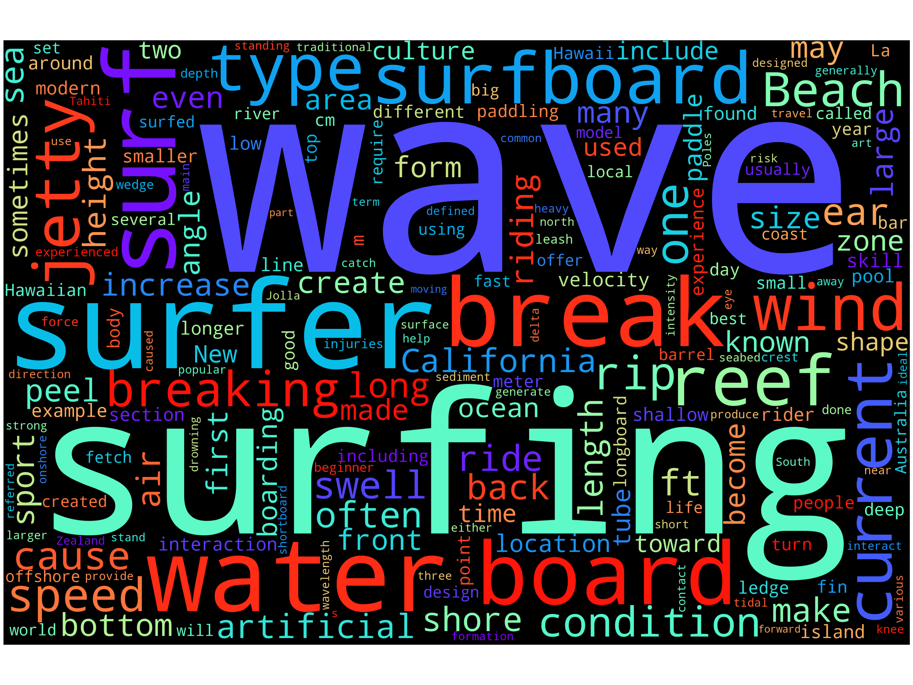
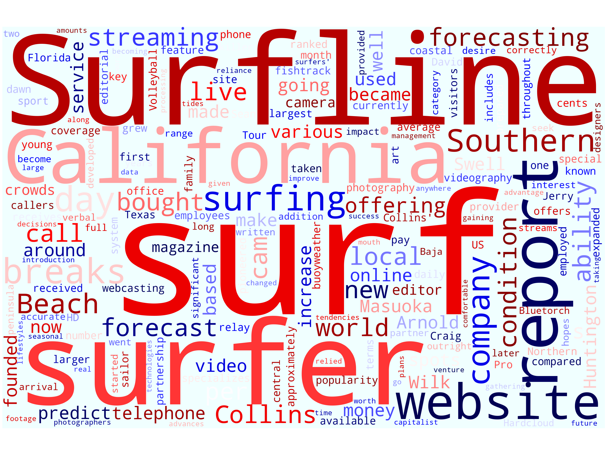

# Word Cloud Generator 
#### Code developed by Jay Sueno using Python, Jupyter Notebooks, Matplotlib, BeautifulSoup, wordcloud, re, and urllib

<br>

## <div align="center"> _Words carry meaning ✨_ </div>

I wanted to create an app to create wordclouds by scraping text from webpages. I'm an avid surfer and wanted to see which words were emphasized in two Wikipedia pages:
* [Surfing](https://en.wikipedia.org/wiki/Surfing)
* [Surfline](https://en.wikipedia.org/wiki/Surfline)

## Text Extraction
Two methods were used to extract the text using python code. It's important to clean the scrapped text to remove stopwords and symbols. 
* First method uses the Python library [wikipedia](https://pypi.org/project/wikipedia/). This is an easy to use built in library for downloading and parsing data, including text.
* Second method is using the Python library [BeautifulSoup](https://www.crummy.com/software/BeautifulSoup/bs4/doc/) in combination with [urllib](https://docs.python.org/3/library/urllib.html). BeautifulSoup is a powerful library and can customize webscraping scraping of websites in general (not just Wikipedia). Urllib is a package that allows you to open and read URLs.

Sample code:
```python
from urllib.request import urlopen
from bs4 import BeautifulSoup

# Specify url of the webpage
source = urlopen('https://en.wikipedia.org/wiki/Surfing')

# Make a soup
soup = BeautifulSoup(source, 'lxml')
```

Webpage HTML is messy and need to delete or replace symbols as needed with the library re or regular expresion. Moreover, we needed to delete the stopwords like 'the' and 'a' using the package named 'STOPWORDS' in the [wordcloud](https://pypi.org/project/wordcloud/) library.

## Create Plot Function
We use matplotlib to create a plot. Create a function that creates the image of the wordcloud, its dimensions, and saves the image. 

```python
# Define a function to plot wordcloud
def plot_cloud(wordcloud, name):
    # Set figure size
    plt.figure(figsize=(40, 30))
    # Display image
    plt.imshow(wordcloud)
    # No axis details
    plt.axis('off')
    plt.tight_layout()
    # Save the figure in file
    plt.savefig(f'images/{name}.png')
```

## The Wordclouds
Now we generate the wordcloud using the function we create. We also define the attributes like the size and colors. 

```python
from wordcloud import WordCloud, STOPWORDS

# Generate wordcloud using text2 with beautiful soup
cloud = WordCloud(width = 3000, height = 2000, random_state=1, background_color='black', 
                  colormap='rainbow', collocations=False, stopwords = STOPWORDS).generate(text2)

plot_cloud(cloud, 'surfing')
```

I'm an avid surfer and I use Surfline every day to check the surf forecast. Therefore, I wanted to see what kinds of words were written about 'surfing' and 'Surfline.'
<br>
### <div align='center'> Surfing </div>



### <div align='center'> Surfline </div>


## Conclusion

And there you go! It's no surprise that some of the words are similar while others are more specific to predictions. What's interest is that California is emphasied in Surfline. But is it surprising? Not really. California has some of the best surf in the world and the company is based there. 

I hope you had fun learning about how to make your own wordclouds by scraping the web. 

